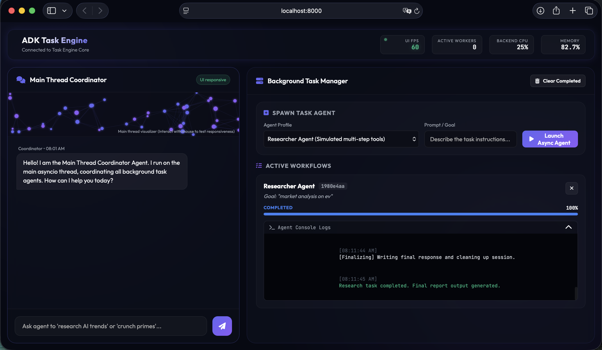

## Background task engine with ADK

Background task engine that allow task agents running asynchronously at the background, while the main thread (conversation or agent) stay responsive.

## How to run

uvicorn main:app --port 8000 

